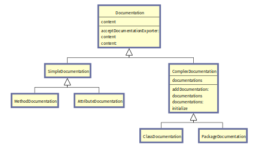
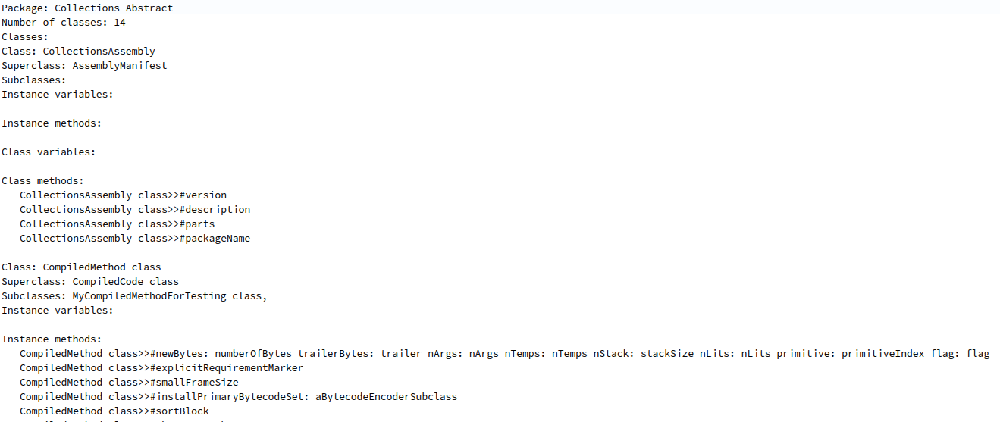

# Pharo Documentation Generator
## Overview
This project is concerned with generating documentation for Pharo source code. In a nutshell, the documentation generation process can be split into two distinct phases:   
1. **a documentation modeling (representation) phase**: defines the structure and content of the documentation.
1. **a documentation exportation phase**: exports a documentation representation into a specific format. 

Clients seeking the generation of source code are only concerned with the usage of the exportation API, if the available documentation exporters fulfill their needs. Otherwise, they are urged to develop their own exportation mechanism for a specific format using the documentation representation API. The currently supported formats include plain text files, or simply logging the documentation onto the console (`Transcript`). Other common and potential formats include **web pages**, **JSON**, **XML**, _etc._

## Documentation Generators
The Pharo documentation generator superclass `PharoDocGenerator` factors all the common state and behavior of the documentation generation process. Actual concrete documentation generators need to subclass it (_i.e., parameterization by specialization_) to define their corresponding documentation representation and exportation mechanisms. 

## Documentation Representation Models
A **documentation representation model** consists of its **content** and its **structure**. The structure, modeled by the abstract class `Documentation`, is either **simple** (`SimpleDocumentation`) or **composite** (`ComplexDocumentation`). This allows the documentation generation process to be achieved at different levels of granularity. Simple documentations are concerned with elements of smaller granularity such as attributes (_e.g., their names, and possibly their types_) and methods (_e.g., signatures_), while complex documentations are reserved for recursive representations of elements and their constitution, children, properties, etc., such as classes (_e.g., by including their instance/class attributes and methods_) and packages (_e.g., by including their classes_).

Concretely, to allow the clients to flexibly choose the scope of their target elements, a trait is associated to each source code element, encapsulating its documentation method (_and potentially other pre-processing and post-processing methods_). Consequently, concrete documentation generators classes can target the source code elements of interest by composing their corresponding traits and defining their corresponding documentation mechanisms.

## Documentation Exporters
The exportation of documentation into specific formats is manifested by the documentation exporters hierarchy, starting from its root abstract class `DocumentationExporter`. For each specific documentation format, a documentation exporter is required. The exportation mechanism is defined once in a concrete documentation exporter, subclass of `DocumentationExporter`, and can only be enabled by a documentation generator (_i.e., the client interface code_). A documentation generator uses one exporter at a time, but has the ability to dynamically switch between different exporters at runtime. Furthermore, existing exporters can later be reused by newly create documentation generators.

Also, by following the **Visitor** design pattern, a documentation exporter is a visitor of the documentation representation model hierarchy. In addition, by leveraging the **Double Dispatch technique** that's available through Pharo's dynamic nature, the visiting mechanism relies both on the visitor and the visited runtime types. This makes their implementation polymorphic across representations and exporters at the same time.

## Querying the API
Currently, the documentation generator API allows a client to instantiate a documentation generator, input an object, and generate documentation for said object. By default, the exportation's content and structure are outputed into the Transcript, but can be also exported into plain text. 

## Examples

## Future Work & Improvements
In future works, we'll allow clients to input symbols instead of objects when they're querying for source code elements of interest. Furthermore, we seek to introduce a reification to the documentation modeling phase, instead of making the documentation generator bear the additional responsibility of creating the documentation representation model for himself (_smells like GOD classes in here_). Indeed, this is key to comply with the **Single Responsibility design principle** from the **SOLID design principles** in software engineering.

To achieve such a reification, a `Documenter` abstract class can be imagined as the superclass of all classes that perform documentation representation tasks. Following such this reification, the documentation generator becomes more modular, and consequently more prone to **Dependency Injection**. This means that a documentation generator can dynamically change his documentation models at runtime as well as their exportation. This can allow the same documentation generator to generate multiple different documentations for different analyses operating on different levels of granularity.

In other aspects, `MethodDocumentation` is considered as having a simple documentation representation (i.e., subclass of `SimpleDocumentation`)in the meantime. However, in a different scenario, if we chose to document further details pertaining to methods, then we can easily start seeing `MethodDocumentation` as becoming a more complex documentation model. To resolve this issue, we have to reimagine the documentation model hierarchy to allow for the same source code elements to have multiple models with different layers of granularity. 

In turn, we must consider refactoring our design to make simple and complex documentation modeling classes as traits. This permits us to distinguish between documentation models based on source code elements, which themselves, in different contexts, can have simple or complex documentation models. As such, `MethodDocumentation` can be viewed as an abstract superclass of all possible `MethodDocumentation` models. These models then can be either **simple** (_using the simple documentation trait_) or **complex** (_using the complex documentation trait_).

Finally, to improve the performance of the documentation generator, we intend to implement a **caching system** that allows each documentation generator to store different representations of different models for different periods of time. According to their simplicity or complexity, certain documentations can be time-consuming to generate if their models are too packed. In such situations, storing the documentation itself in memory (_buffers_) or on the disk (_files_) for further reuse, can be practical. 